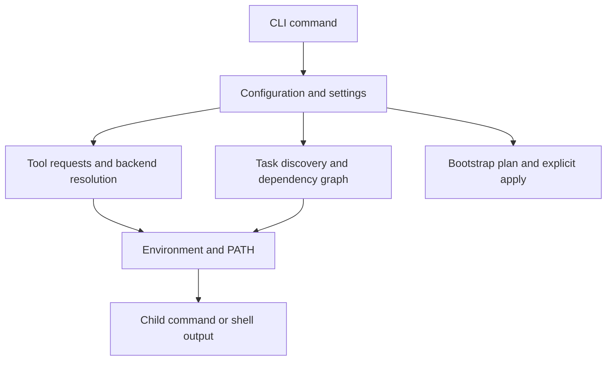

# mise 架构

此地图供贡献者决定某个行为应归属何处。从暴露该行为的命令开始，然后沿着配置、工具解析或任务执行进入所属子系统。[贡献指南](/contributing.html)涵盖设置、检查和生成文件。

## 系统概览

mise 通过 [bootstrap](/bootstrap.html) 结合了版本化开发工具、环境构建、任务执行以及显式的机器设置。这些功能共享配置和执行辅助工具，但具有不同的状态和副作用。安装版本化工具与应用主机软件包或 dotfile 声明不是同一种操作。



## 核心架构组件

### 命令层

[`src/cli`](https://github.com/jdx/mise/tree/main/src/cli) 使用 `usage_rs` 派生命令，并从 `src/cli/mod.rs` 分发这些命令。同一份 usage 规范会生成帮助信息、补全和 CLI 文档。应在命令源代码中修改命令描述，然后重新生成输出；不要手动编辑生成的参考页面。

命令会委托给子系统代码。有些命令是同步的本地查询；其他命令会执行异步请求或协调并发工作。避免向原本用于检查本地状态的路径添加安装或网络副作用。

有用的入口包括：用于安装并选择行为的 `use.rs`、用于安装的 `install.rs`、用于子进程环境的 `exec.rs`、用于任务的 `run.rs`，以及用于机器设置的 `bootstrap.rs`。`activate.rs` 生成 shell 集成，而 `shell.rs` 设置会话专用的工具请求。

### 后端系统

[`Backend` trait](https://github.com/jdx/mise/blob/main/src/backend/mod.rs) 将共享策略与后端特定的元数据、安装和环境逻辑分离。公共包装方法处理缓存和解析等通用工作；`_list_remote_versions` 和 `install_version_` 等实现钩子则提供后端行为。

根据来源选择匹配的实现系列：

- 原生核心运行时位于 `src/plugins/core` 下。
- Release 和 registry 集成，包括 packslip、Aqua、GitHub、GitLab 和 HTTP，位于 `src/backend` 下。
- 语言软件包集成包括 npm、pipx、cargo、gem 和 Go。
- asdf 和 vfox 适配器桥接外部插件接口。

后端选择可能取决于 registry 元数据、显式覆盖、请求的版本以及匹配的 lock 条目。它不是在通用版本排序器之后做出的一次性选择。版本是不透明的请求：使用后端解析方法，而不是假设 SemVer，或在新的调用点对任意已安装版本进行排序。

参见 [Backend Architecture](/dev-tools/backend_architecture.html) 和
[Adding Backends](/contributing.html#adding-backends)。

### 配置系统

[`src/config`](https://github.com/jdx/mise/tree/main/src/config) 负责发现、加载和合并配置。`ConfigFile` 的实现包括 `MiseToml`、`ToolVersions` 和 `IdiomaticVersionFile`。完整的优先级规则见[配置](/configuration.html)。

要区分以下三个决策：发现哪些文件、这些文件是否可以被信任或执行，以及每个字段如何合并。设置、工具、环境指令、任务和 bootstrap 条目并不都使用相同的合并策略。写入命令还有自己的[目标文件选择](/configuration.html#target-file-for-write-operations)。

`settings.toml` 定义设置元数据和文档。TOML 示例使用 TOML 1.1，包括多行内联表；仅支持 TOML 1.0 的验证器会拒绝有效示例。

### 工具集管理

[`src/toolset`](https://github.com/jdx/mise/tree/main/src/toolset) 将请求连接到选定的版本和安装状态：

| 类型             | 作用                                                                                  |
| ---------------- | ------------------------------------------------------------------------------------- |
| `ToolRequest`    | 例如 `node@24`、channel 或 ref 的请求，以及后端/选项上下文                               |
| `ToolVersion`    | 已解析的版本及其安装元数据                                                               |
| `Toolset`        | 当前上下文中的请求和已解析版本                                                           |
| `ToolsetBuilder` | 组合配置、运行时环境覆盖和显式参数，然后进行解析                                         |

解析、依赖排序、安装和环境构建是相关但彼此独立的操作。只读列表不需要安装缺失的工具。执行命令可能会根据其设置安装工具。从 lock 条目解析请求时，应保留 lockfile 中的后端和校验和信息。

### 任务系统

[`src/task`](https://github.com/jdx/mise/tree/main/src/task) 负责发现、依赖关系、新鲜度/缓存决策和执行。`Task` 存储定义；任务文件提供者加载本地和远程来源；`Deps` 表示依赖图；执行器根据配置的并发和输出策略运行就绪任务。

`depends` 选择前置任务，`depends_post` 选择后续任务，而 `wait_for` 仅在任务已经属于所选图时对任务进行排序。在任务身份中还包括参数、环境和执行阶段。在更改图构建、重复项处理或完成传播之前，请检查[任务架构](/tasks/architecture.html)。

### 插件系统

[`src/plugins`](https://github.com/jdx/mise/tree/main/src/plugins) 管理插件来源和安装元数据。[`crates/vfox`](https://github.com/jdx/mise/tree/main/crates/vfox) 提供嵌入式 Lua 运行时以及钩子/模块接口。

工具钩子管理一个 SDK，后端钩子管理 `plugin:tool` 请求，环境钩子返回变量/PATH，软件包钩子管理主机软件包批次。asdf 适配器执行旧版 shell 脚本。插件源安装与工具版本安装拥有独立的状态和更新操作。参见[插件](/plugins.html)。

### Shell 集成

[`src/shell`](https://github.com/jdx/mise/tree/main/src/shell) 生成特定于 shell 的激活和环境赋值。`mise activate` 注册提示符/目录钩子；钩子执行会计算环境差异，以便 mise 在应用新上下文之前撤销其之前的更改。`mise exec` 直接构建子进程环境，不需要激活。

在 mise 和子进程中保留原生 Windows PATH。仅应在明确识别出的 shell 输出边界进行转换；有关实现限制，请参见仓库的[代理指南](https://github.com/jdx/mise/blob/main/AGENTS.md)。

### 环境管理

`src/config/env_directive` 负责评估环境指令，`EnvDiff` 跟踪更改，`PathEnv` 处理 PATH 条目。与工具无关的指令和感知工具的指令在不同阶段运行。调用子进程时使用由 mise 构建的环境；继承过时的进程环境可能会丢失之前的指令，或使用错误的运行时。

参见[环境变量](/environments/)和[模板](/templates.html)。

### Bootstrap 和主机状态

`src/cli/bootstrap.rs` 协调计划和选定阶段。`src/system` 下的实现负责软件包、文件、编辑、仓库和特定于平台的资源。状态、预览、应用和清理具有不同的契约。例如，软件包状态检查不得安装任何内容，而选定的软件包批次并不是完整的期望状态快照。

在更改所有权、确认、回滚或移除行为之前，请阅读相关的 [bootstrap 资源指南](/bootstrap.html)。主机管理的状态通常不包含在版本化工具的安装目录中。

### 缓存系统

[`src/cache.rs`](https://github.com/jdx/mise/blob/main/src/cache.rs) 提供带有新鲜度策略和原子写入的 `CacheManager<T>`。其序列化缓存使用带 zlib 压缩的 MessagePack。其他子系统拥有自己的格式和失效规则，包括以会话密钥为键的环境缓存以及本地/远程任务缓存。

缓存键必须包含所有会改变结果的输入，包括相关选项、环境和来源元数据。有关面向用户的刷新控制和限制，请参见[缓存行为](/cache-behavior.html)。

## 测试架构

使用能够证明该行为的最小测试层。纯解析或解析逻辑适合单元测试；shell 边界、安装和任务执行通常需要端到端测试。网络和主机软件包测试所需的前置条件不止 Rust 编译器。

### 单元测试

测试位于源模块旁边以及工作区 crate 中。主二进制的 `src/test.rs` 初始化共享的 fixture 目录和进程环境。测试配置为单线程运行；这并不意味着每个 Rust 测试都会使用全新的进程或 HOME。对临时环境/当前目录更改使用现有 guard，并在失败时恢复它们。

### 端到端测试

`e2e` harness 使用隔离的 mise 配置/数据/状态和临时工作目录运行 Bash 测试。通过 `mise run test:e2e` 启动它，该命令会构建 mise，并通过仓库的任务包装器选择文件。主机程序和服务仍然是外部前置条件；隔离不会替你安装 Docker、JDK 或所有 shell。

```sh
mise run test:e2e e2e/cli/test_version
mise run test:e2e '^test_task_'
mise run test:e2e --all
```

该包装器匹配测试**基本名称**，而不是目录前缀。在更改测试选择说明之前，请使用 `mise tasks info test:e2e` 检查其当前源代码。

使用 `e2e/assert.sh` 中的辅助函数，并让 harness 管理清理工作。不要直接执行测试文件，也不要仅为了运行它们而添加可执行权限。

### Windows 测试

`e2e-win` 使用 PowerShell 和 Pester。测试应运行生成的命令并检查真实的子进程行为，尤其是 PATH 和激活行为，而不只是比较输出字符串。参见 [Windows E2E setup](/contributing.html#windows-e2e-tests)。

### Snapshot 测试

`insta` snapshot 会记录结构化输出或面向用户的输出。应将每个发生更改的 snapshot 作为行为变更的一部分进行审查；接受所有 snapshot 不能证明新输出是正确的。`mise run snapshots` 使用项目的任务配置更新 snapshot。

### 测试基础设施特性

仓库在 `xtasks/test` 下提供用于 E2E 选择和性能工作的文件任务。运行缓慢的 E2E 文件以 `_slow` 结尾，并需要 `TEST_ALL=1`。完整运行器可以使用 `TEST_TRANCHE` 和 `TEST_TRANCHE_COUNT` 分割工作。CI 提供平台依赖和检测工具；名为 `coverage` 的任务本身不会为本地二进制添加检测。

有关确切命令和前置条件，请参见[测试](/contributing.html#testing)。

## 相关架构文档

- [任务架构](/tasks/architecture.html)。
- [后端架构](/dev-tools/backend_architecture.html)。
- [配置](/configuration.html)。
- [贡献](/contributing.html)。
