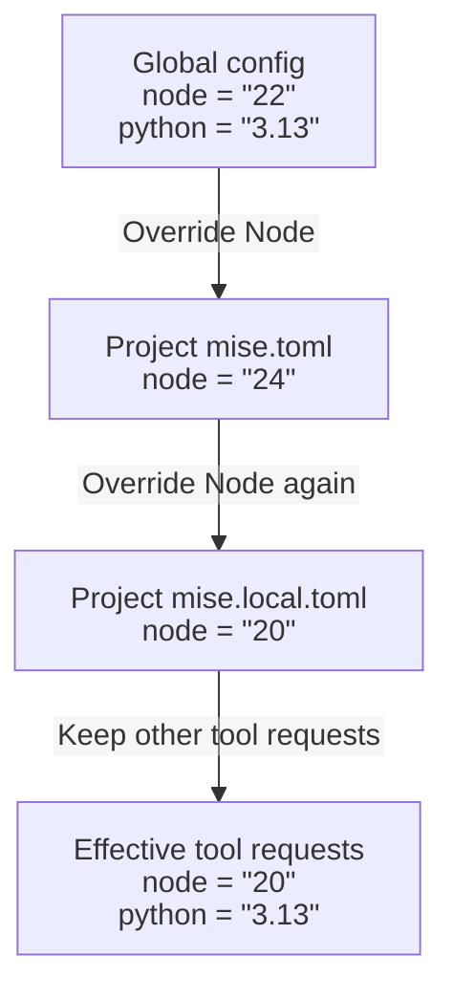

# Configuration

A project's `mise.toml` declares tools, environment variables, and tasks. Global
configuration supplies personal defaults; project and local files override them.

Start with one file in the project root:

```toml [mise.toml]
[tools]
node = "24"

[env]
NODE_ENV = "development"

[tasks.hello]
run = "node --eval 'console.log(process.env.NODE_ENV)'"
```

Run `mise run hello` to install the declared tool if needed and print
`development`. Use `mise config` to see the active config files and
`mise ls --current` to see the selected tool versions.

| Configure                                  | Reference                                               |
| ------------------------------------------ | ------------------------------------------------------- |
| Tool versions and installation options     | [Dev tools](/dev-tools/)                                |
| Variables passed to commands               | [Environments](/environments/)                          |
| Reusable values inside templates           | [Variables](/configuration/vars.html)                   |
| Development, test, and production overlays | [Config Environments](/configuration/environments.html) |
| Commands and dependencies                  | [Tasks](/tasks/)                                        |
| mise's own behavior                        | [Settings](/configuration/settings.html)                |

## `mise.toml`

`mise.toml` is the config file for mise. It can live at any of the following paths (in order of precedence; files higher in the list override those lower down):

- `mise.local.toml` - used for local config; this should not be committed to source control
- `mise.toml`
- `mise/config.toml`
- `mise/conf.d/*.toml` - 此目录中的所有非隐藏 TOML 文件都会按字母顺序加载；类似 `x.base.toml` 这样的带点名称[正在弃用](/configuration/environments.html#conf-d-environments)，只有在 `env_conf_d = true` 时才会为匹配的环境加载
- `.mise/config.toml`
- `.mise/conf.d/*.toml` - all non-hidden TOML files in this directory are loaded in alphabetical order; dotted names like `x.base.toml` are [being deprecated](/configuration/environments.html#conf-d-environments) and load only for the matching environment under `env_conf_d = true`
- `.config/mise.toml` - use this to group config files in a common directory
- `.config/mise/config.toml`
- `.config/mise/conf.d/*.toml` - 在归组配置目录下，分片加载和[弃用](/configuration/environments.html#conf-d-environments)行为相同

::: tip
Run [`mise config`](/cli/config.html) to see the order in which mise loads files on your setup. This is often
much easier than working through mise's rules.
:::

注意：

- Paths that start with `mise` can be dotfiles, e.g. `.mise.toml` or `.mise/config.toml`.
- This list doesn't include [Configuration Environments](/configuration/environments), which allow environment-specific config files like `mise.development.toml`—selected with `MISE_ENV=development`. Platform-specific environments like `mise.windows.toml` or `mise.macos-arm64.toml` can be enabled automatically with the [`auto_env` setting](/configuration/environments.html#platform-environments).
- See [`LOCAL_CONFIG_FILENAMES` in `src/config/mod.rs`](https://github.com/jdx/mise/blob/main/src/config/mod.rs) for the actual code for these paths and their precedence. Some legacy paths are not listed here for brevity.

## 配置层级

mise uses a hierarchical configuration system that merges settings from multiple sources. Understanding this hierarchy helps you organize your development environments.

### 配置合并的工作方式

mise looks for these files in every parent directory, so if you have a `~/src/work/myproj/mise.toml` file,
what is defined there overrides anything set in
`~/src/work/mise.toml` or `~/.config/mise.toml`. The config contents are merged.

### 配置解析过程

当 mise 需要配置时，它会遵循以下过程：

1. Reads early configuration, including the selected config environments.
2. Discovers system and global config, then searches the current directory and its
   parents up to the root or `MISE_CEILING_PATHS`.
3. Includes matching environment-specific files at each level of that hierarchy.
4. Merges the files with child directories taking precedence over parents, and
   same-directory variants following the order above.

An environment-specific parent file does not override an ordinary child file
just because it names an environment. Environment selection is part of file
discovery, not a final override applied after the hierarchy.

### 可视化配置层级

```
/
├── etc/mise/                         # 系统范围配置（最低优先级）
│   ├── conf.d/*.toml                 # 系统分片，按字母顺序加载
│   ├── config.toml                   # 系统默认配置
│   └── config.<env>.toml             # 特定环境的系统配置（MISE_ENV 或 -E）
└── home/user/
    ├── .config/mise/
    │   ├── conf.d/*.toml             # 用户分片，按字母顺序加载
    │   ├── config.toml               # 全局用户配置
    │   ├── config.<env>.toml         # 特定环境的用户配置
    │   ├── config.local.toml         # 用户本地覆盖
    │   └── config.<env>.local.toml   # 特定环境的用户本地覆盖
    └── work/
        ├── mise.toml                 # 工作区范围设置
        └── myproject/
            ├── mise.local.toml       # Local overrides (git-ignored)
            ├── mise.toml             # Project config
            ├── mise/
            │   ├── config.toml       # Visible grouped project config
            │   └── conf.d/*.toml     # Visible project fragments, loaded alphabetically
            ├── .mise/
            │   ├── config.toml       # 归入 .mise 的项目配置
            │   └── conf.d/*.toml     # 项目分片，按字母顺序加载
            ├── mise.<env>.toml       # 特定环境的项目配置
            ├── mise.<env>.local.toml # 特定环境的项目本地覆盖
            └── backend/
                └── mise.toml         # 特定服务配置（最高优先级）
```

### Example: merging tool versions

For a project with these three config files, each later file overrides the same
tool from an earlier file. A tool omitted from the later files is inherited.
All entries shown below belong to each file's `[tools]` section.



The local file wins for Node; Python keeps its global request. These are version
requests, which mise still resolves to concrete tool versions. This example
illustrates `[tools]`; other sections have the merge rules below.

### Merge Behavior by Section

不同的配置部分会以不同方式合并：

**工具** (`[tools]`): 以覆盖方式叠加

```toml
# 全局：node@18, python@3.11
# 项目：node@20, go@1.21
# 结果：node@20, python@3.11, go@1.21
```

**工具策略** (`[tool_config]`): 仅应用于由共享同一配置根目录的配置声明的工具；不会合并到整个调用范围的设置中

```toml
[tool_config]
locked = true
```

**环境变量** (`[env]`): 累加并允许覆盖

```toml
# 全局：NODE_ENV=development
# 项目：NODE_ENV=production, API_URL=localhost
# 结果：NODE_ENV=production, API_URL=localhost
```

**Tasks** (`[tasks]`): A more specific command definition replaces the earlier command

```toml
# Global: [tasks.test] = "npm test"
# Project: [tasks.test] = "yarn test"
# Result: "yarn test"
```

Metadata-only task definitions can overlay an existing task without replacing its
command. Included task files and file tasks have additional merge rules; see
[`task_config.includes`](/tasks/task-configuration.html#task_config.includes).

**Settings** (`[settings]`): Additive with overrides

```toml
# 全局：experimental = true
# 项目：jobs = 4
# 结果：experimental = true, jobs = 4
```

::: tip
运行 `mise config` 查看 mise 按优先级顺序加载了哪些文件。
:::

### 写入操作的目标文件

When commands like [`mise use`](/cli/use), [`mise set`](/cli/set), or [`mise unset`](/cli/unset) need to write to a config file, they use the **lowest precedence file in the highest precedence directory**. This means:

- 如果 `mise.toml` 和 `mise.local.toml` 都存在，则写入 `mise.toml`
- 如果 `mise.toml` 和 `mise.production.toml` 都存在，则写入 `mise.toml`
- 如果只存在 `mise.local.toml`，则写入 `mise.local.toml`

这种行为确保共享配置（`mise.toml`）默认会被更新，而本地覆盖（`mise.local.toml`）和特定环境配置则保持不变，除非明确指定目标。

::: info 示例

```bash
# 当同时存在 mise.toml 和 mise.local.toml 时：
$ mise use node@22              # 写入 mise.toml
$ mise use --env local node@20  # 写入 mise.local.toml
$ mise set NODE_ENV=production  # 写入 mise.toml
```

:::

Other commands select files differently:

- [`mise config get`](/cli/config/get) and [`mise config set`](/cli/config/set) default to the **highest-precedence loaded TOML file**, which can be `mise.local.toml`. Use `--file` to choose an existing project file explicitly.
- [`mise unuse`](/cli/unuse) defaults to the first loaded config that declares any requested tool. A version-qualified argument matches the literal configured request: `node@20` matches `node = "20"`, not `node = "20.0.0"`. Use `--path` to choose the file.

### `[tools]` - 开发工具

参见 [工具](/dev-tools/)。除了指定版本之外，每个工具条目还可以包含以下选项：

- `os`: Restrict installation to certain operating systems
- `depends`: Install order relative to other tools in this config only; vfox plugin hook dependencies belong in plugin `metadata.lua` (see [Tool Dependencies](/dev-tools/#tool-dependencies))
- `install_env`: Environment vars used during download, install, and tool-level `postinstall`
- `postinstall`: Command to run after installation completes for that specific tool

示例：

```toml
[tools]
node = { version = "22", postinstall = "corepack enable" }
```

### `[tool_config]` - 配置根目录范围的工具策略

`[tool_config]` 会将策略应用于由共享同一配置根目录的配置声明的工具。例如，`mise.local.toml` 中的策略也会应用于其旁边的 `mise.toml` 中的工具。它不会影响从全局、系统或父级配置根目录继承的工具。

```toml
[tool_config]
locked = true

[tools]
node = "24"
```

目前，`locked` 是唯一受支持的策略。它要求此配置根目录中的工具从其锁定文件解析并安装。参见 [mise.lock](/dev-tools/mise-lock.html#strict-lockfile-mode)。

### `[env]` - 任意环境变量

请参阅 [环境](/environments/)。

### `[vars]` - 配置变量

定义可在 Tera 渲染的配置中重复使用的值，而不会将它们导出给子进程。请参阅 [变量](/configuration/vars)。

### `[tasks.*]` - 运行文件或 Shell 脚本

参见 [任务](/tasks/)。

### `[settings]` - Mise 设置

参见 [设置](/configuration/settings) 获取完整的设置列表。

### `[plugins]` - 指定自定义插件仓库 URL

Use `[plugins]` to add or modify plugin shortnames. This only affects
_new_ plugin installations; existing plugins can use any URL.

```toml
[plugins]
elixir = "https://github.com/my-org/mise-elixir.git"
node = "https://github.com/my-org/mise-node.git#DEADBEEF" # 支持特定 gitref
"vfox-backend:myplugin" = "https://github.com/jdx/vfox-npm"
```

插件类型前缀（例如 `asdf:`、`vfox:` 或 `vfox-backend:`）是可选的。
如果省略，mise 会先克隆该插件，然后从已安装的插件文件中检测插件类型。

To install a plugin from a specific URL once, use
`mise plugin install <NAME> <GIT_URL>` instead. Add this section to `mise.toml` when you want
to share the plugin location and revision with other developers in your project.

本地插件目录同样受支持。绝对路径和以 `~/` 开头的路径会直接使用。以 `./` 或 `../` 开头的显式相对路径，会相对于声明它们的文件所在配置根目录进行解析：

```toml
[plugins]
example = "./plugins/mise-example"
```

本地插件会以符号链接的形式链接到 mise 的插件目录中，其行为与
`mise plugins link` 一致，因此源目录中的更改会立即生效。
与远程条目一样，`[plugins]` 只会影响新安装。运行
`mise plugins install --force <NAME>`，可使用配置的本地源替换现有插件。
`file://` 源仍然是 Git 仓库，并且会被克隆。

这取代了已弃用的 `settings.shorthands_file` / `MISE_SHORTHANDS_FILE` 机制：将相同的
`shortname = "backend-or-url"` 条目放在 `[plugins]` 下，而不是放在单独的 TOML 文件中。

### `[tool_alias]` - 工具版本别名

::: tip
`[alias]` 已重命名为 `[tool_alias]`，以将其与 `[shell_alias]` 区分开来。
旧的 `[alias]` 键仍然可用，但已被弃用。
:::

The following makes `mise install node@my_custom_node` install node-20.x.
Aliases can also be specified in a [plugin](/dev-tools/aliases.md).

```toml
[tool_alias.node.versions]
my_custom_node = '20'
```

### `[shell_alias]` - Shell 别名

定义在进入目录时设置、离开目录时取消设置的 shell 别名：

```toml
[shell_alias]
ll = "ls -la"
gs = "git status"
dev = "npm run dev"
```

These work similarly to environment variables—they're set dynamically based on your current directory.
See [Shell Aliases](/shell-aliases) for more details.

### 最低 mise 版本

Specify the minimum mise version required by the configuration file.

你可以设置硬性最低版本（不满足时会报错）或软性最低版本（会警告并继续）：

```toml
# Require this version or newer
min_version = '2024.11.1'
```

Or specify a hard minimum and a newer recommended version:

```toml
min_version = { hard = '2024.11.1', soft = '2026.1.0' }
```

When a soft minimum is not met, mise prints a warning and, if available, self-update instructions. When a hard minimum is not met, mise errors and shows self-update instructions.

Use a hard minimum for syntax or behavior the project requires. A soft minimum
recommends an upgrade while allowing older clients to continue. A soft-only
requirement is also valid: `min_version = { soft = '2026.1.0' }`.

Keep mise current so backend integrations and deprecation notices stay up to date.
A minimum version lets teammates upgrade without changing the project's requirement.

### Monorepo 根目录

将配置文件标记为 monorepo 根目录，以便为任务启用目标路径语法。

```toml
monorepo_root = true

[monorepo]
config_roots = ["projects/frontend", "projects/api"]
```

`monorepo_root` enables task addressing; `config_roots` identifies the projects to
load. When enabled:

- Tasks in subdirectories are available with namespaced paths (e.g., `//projects/frontend:build`)
- Subdirectory tasks use tools from parent configs
- Tasks are only loaded when needed (e.g., when running them, or with `mise tasks ls --all`)
- Trusting a monorepo root allows descendant configs to share that trust; review
  the repository before trusting it (see [trust behavior](/cli/trust.html))

有关详细用法和示例，请参见 [Monorepo 任务](/tasks/monorepo)。

### `mise.toml` 架构

- You can find the JSON schema for `mise.toml` in [schema/mise.json](https://github.com/jdx/mise/blob/main/schema/mise.json) or at <https://mise.jdx.dev/schema/mise.json>.
- Some editors can load it automatically to provide autocompletion and validation when editing a `mise.toml` file ([VSCode](https://code.visualstudio.com/docs/languages/json#_json-schemas-and-settings), [IntelliJ](https://www.jetbrains.com/help/idea/json.html#ws_json_using_schemas), [neovim](https://github.com/b0o/SchemaStore.nvim), etc.). It is also available in the [JSON schema store](https://www.schemastore.org/).
- `included tasks` (see [task configuration](/tasks/task-configuration)) use a separate schema: <https://mise.jdx.dev/schema/mise-task.json>

## 全局配置：`~/.config/mise/config.toml`

可以在 `~/.config/mise/config.toml` 中配置 mise。它的作用类似于本地的 `mise.toml`，但会应用于每个目录。

这里只展示了一些常见设置。完整列表和说明请参阅 [设置](/configuration/settings)。

```toml [~/.config/mise/config.toml]
[tools]
# 全局工具版本写在这里
# 你可以使用 `mise use -g` 来设置这些
node = 'lts'
python = ['3.10', '3.11']

[settings]
# 读取其他版本管理器使用的版本文件，例如 .nvmrc
idiomatic_version_file_enable_tools = ['node']

trusted_config_paths = [
    '~/work/my-trusted-projects',
]

env_file = '.env' # 从 dotenv 文件加载环境变量，参见 `MISE_ENV_FILE`

[settings.status]
show_env = false
show_tools = false

# "_" 是一个特殊键，用于放置你想写入 mise.toml 但 mise 永远不会解析的信息
[_]
foo = "bar"
```

## 系统配置：`/etc/mise/config.toml`

Like `~/.config/mise/config.toml`, but applied to all users on the system. This is useful for
setting system-wide defaults.

## `.tool-versions`

The `.tool-versions` file is asdf's config file, and mise can use it just like `mise.toml`.
It isn't as flexible, so `mise.toml` is recommended instead. It is useful if you
already have many `.tool-versions` files or work on a team that uses asdf.

下面是一个包含所有受支持语法的示例：

```text
node        20.0.0       # 允许使用注释
ruby        3            # 可以是模糊版本
shellcheck  latest       # 也支持 "latest"
jq          1.6
erlang      ref:master   # 从 vcs ref 编译
go          prefix:1.19  # 使用最新的 1.19.x 版本——在 "1.19" 恰好匹配时需要
shfmt       path:./shfmt # 使用自定义运行时
node        lts          # 使用 node 的 lts 版本（并非所有插件都支持）

node        sub-2:lts      # 从解析出的主版本号中减去 2（例如：20 变为 18）
python      sub-0.1:latest # 从解析出的次版本号中减去 1（例如：3.11 变为 3.10）
```

有关此文件格式的更多信息，请参见 [asdf 文档](https://asdf-vm.com/manage/configuration.html#tool-versions)。

## 作用域

Both `mise.toml` and `.tool-versions` support "scopes", which modify how a version is resolved:

- `ref:<SHA>` - compile from a vcs (usually git) ref
- `prefix:<PREFIX>` - use the latest version that matches the prefix. Useful for Go, since `1.20`
  would only match `1.20` exactly, whereas `prefix:1.20` matches `1.20.1`, `1.20.2`, etc.
- `path:<PATH>` - use a custom compiled version at the given path. One use case is reusing
  Homebrew tools (e.g. `path:/opt/homebrew/opt/node@20`). On Windows both separators work and
  mise stores the forward-slash form either way, but mind the TOML quoting: a backslash is an
  escape inside a _basic_ (double-quoted) string, so write `{ path = 'C:\tools\node' }` as a
  literal string, or double them as `"C:\\tools\\node"`. `"C:\tools\node"` is not rejected — TOML
  reads `\t` as a tab — so the path silently becomes something else. A path containing a `cmd.exe`
  metacharacter (`& | < > ^ %`) is rejected there, since the path is passed to tool plugins that
  build shell commands with it; `%` in particular is not a literal.
- `sub-<PARTIAL_VERSION>:<ORIG_VERSION>` - resolves `ORIG_VERSION`, subtracts the numeric components
  in `PARTIAL_VERSION` from the corresponding resolved version components, then resolves the result
  as a version prefix. For example, `sub-2:lts` resolves `lts` and subtracts 2 from its major
  component (`20` becomes `18`), while `sub-0.1:latest` subtracts 1 from the resolved minor
  component (`3.11` becomes `3.10`). This is numeric version arithmetic, not a request for the Nth
  previous release.

## 惯用版本文件

mise supports "idiomatic version files" just like asdf. They're language-specific files
like `.node-version` and `.python-version`. These are ideal for setting the runtime version of a project without forcing
other developers to use a specific tool like mise or asdf.

They support aliases, so an `.nvmrc` file containing `lts/hydrogen` works
in both mise and nvm. Here are some of the supported idiomatic version files:

<!-- mise:idiomatic-version-files:start -->

| 插件          | 惯用文件                                                                                                                                                                                                                                                                                             |
| ------------- | ---------------------------------------------------------------------------------------------------------------------------------------------------------------------------------------------------------------------------------------------------------------------------------------------------------- |
| atmos         | `.atmos-version`                                                                                                                                                                                                                                                                                           |
| bun           | `.bun-version`, `package.json`                                                                                                                                                                                                                                                                             |
| chezmoi       | `.chezmoiversion`                                                                                                                                                                                                                                                                                          |
| cmake         | `CMakeLists.txt`                                                                                                                                                                                                                                                                                           |
| crystal       | `.crystal-version`                                                                                                                                                                                                                                                                                         |
| dagger        | `dagger.json`                                                                                                                                                                                                                                                                                              |
| deno          | `.deno-version`, `package.json`                                                                                                                                                                                                                                                                            |
| dotnet        | `global.json`                                                                                                                                                                                                                                                                                              |
| earthly       | `Earthfile`                                                                                                                                                                                                                                                                                                |
| elixir        | `.exenv-version`                                                                                                                                                                                                                                                                                           |
| go            | `.go-version`, `go.mod`                                                                                                                                                                                                                                                                                    |
| golangci-lint | `.golangci.yml`, `.golangci.yaml`, `.golangci.toml`, `.golangci.json`                                                                                                                                                                                                                                      |
| goreleaser    | `.config/goreleaser.yml`, `.config/goreleaser.yaml`, `.goreleaser.yml`, `.goreleaser.yaml`, `goreleaser.yml`, `goreleaser.yaml`                                                                                                                                                                            |
| java          | `.java-version`, `.sdkmanrc`                                                                                                                                                                                                                                                                               |
| lefthook      | `lefthook.yml`, `lefthook.yaml`, `.lefthook.yml`, `.lefthook.yaml`, `lefthook.toml`, `.lefthook.toml`, `lefthook.json`, `.lefthook.json`, `lefthook.jsonc`, `.lefthook.jsonc`, `.config/lefthook.yml`, `.config/lefthook.yaml`, `.config/lefthook.toml`, `.config/lefthook.json`, `.config/lefthook.jsonc` |
| node          | `.nvmrc`, `.node-version`, `package.json`                                                                                                                                                                                                                                                                  |
| npm           | `package.json`                                                                                                                                                                                                                                                                                             |
| opentofu      | `.opentofu-version`                                                                                                                                                                                                                                                                                        |
| packer        | `.packer-version`                                                                                                                                                                                                                                                                                            |
| perl          | `.perl-version`                                                                                                                                                                                                                                                                                            |
| pixi          | `pixi.toml`, `pyproject.toml`                                                                                                                                                                                                                                                                              |
| pnpm          | `package.json`                                                                                                                                                                                                                                                                                             |
| pre-commit    | `.pre-commit-config.yaml`                                                                                                                                                                                                                                                                                  |
| python        | `.python-version`, `.python-versions`                                                                                                                                                                                                                                                                      |
| ruby          | `.ruby-version`, `Gemfile`                                                                                                                                                                                                                                                                                 |
| ruff          | `ruff.toml`, `.ruff.toml`                                                                                                                                                                                                                                                                                  |
| rust          | `rust-toolchain.toml`                                                                                                                                                                                                                                                                                      |
| swift         | `.swift-version`                                                                                                                                                                                                                                                                                           |
| task          | `Taskfile.yml`, `Taskfile.yaml`, `taskfile.yml`, `taskfile.yaml`                                                                                                                                                                                                                                           |
| terraform     | `.terraform-version`                                                                                                                                                                                                                                                                                       |
| terragrunt    | `.terragrunt-version`                                                                                                                                                                                                                                                                                      |
| terramate     | `.terramate-version`                                                                                                                                                                                                                                                                                      |
| yarn          | `.yvmrc`, `package.json`                                                                                                                                                                                                                                                                                   |
| zig           | `.zig-version`                                                                                                                                                                                                                                                                                             |

<!-- mise:idiomatic-version-files:end -->

Registry-backed tools can also describe how mise should extract versions from structured
idiomatic files. Registry entries may use the same `version_regex`, `version_json_path`, and
`version_expr` parsers as the [HTTP backend](/dev-tools/backends/http.html#version-list-url).
This lets tools installed through backends such as `aqua:` and `github:` support JSON manifests
and other tool-specific version files without requiring an asdf or vfox plugin.

### mise 读取哪些字段

An idiomatic version file is only read for fields that declare **the version the project is built
with**. Fields that declare a **minimum compatible version** — a floor for whoever consumes the
project — are not version requests and mise does not install from them. A floor says nothing about
which version the project is developed and tested against: a library that still supports Node 18
or CMake 3.25 is almost certainly not built with it, so resolving the floor either pins everyone to
the oldest supported release or, read as a range, means "latest".

配置格式的主版本号有所不同，仍然会被读取：GoReleaser 配置中的 `version: 2` 是有意与 CLI 主版本绑定的架构选择器，而不是兼容性最低版本，因此它会选择最新的 GoReleaser 2.x。

::: warning
mise 过去会将两个最低版本视为版本请求。这两者均已弃用，在解析出版本时会发出警告，并将在 mise 2026.11.0 中移除：`go.mod` 的 `go X.Y` 指令（请向 `go.mod` 添加 `toolchain goX.Y.Z` 行，或使用 `.go-version` 或 `mise.toml`）以及 `CMakeLists.txt` 的 `cmake_minimum_required`（请使用 `mise.toml`）。

已经完成迁移的项目可以在此之前选择最终行为——忽略最低版本且不发出警告：

```sh
mise settings set idiomatic_version_file_ignore_minimum_versions true
```

该设置将在 2026.11.0 中与其控制的行为一起移除。
:::

对于 `package.json`（由 `node`、`deno`、`bun`、`npm`、`pnpm` 和 `yarn` 支持）：

- 运行时工具（`node`、`deno` 和 `bun`）读取 `devEngines.runtime`（同时支持单对象和数组格式）。
- 包管理器（`npm`、`pnpm` 和 `yarn`）读取 `devEngines.packageManager` 或顶层的 `packageManager`（例如 `pnpm@9.1.0` 或 `npm@10.0.0`）。
- 对于 `bun`，mise 会首先检查 `devEngines.runtime`，然后回退到 `devEngines.packageManager` 和顶层的 `packageManager`（例如 `bun@1.2.0`）。

不会读取 `engines` 字段，这正是上述规则最清晰的例子。`engines` 声明的是软件包兼容的 Node 版本范围——当有人在不受支持的运行时上安装软件包时，npm 会使用它来发出警告或失败。它描述的是使用者，而不是开发者；而且它通常是一个很宽的范围（`>=18`），没有人会严格使用该范围进行开发。npm 专门添加的 `devEngines` 正是为了填补这一空白，它声明项目开发者实际使用的版本，这正是 mise 所需的信息。如果你只有 `engines`，请显式固定实际版本：

```sh
mise use node@22
```

对于 `go.mod`，会使用 `toolchain goX.Y.Z` 指令——这是模块构建和测试所使用工具链的精确固定版本。`go X.Y` 指令表示最低版本，已被弃用（见上文）。

### 启用惯用版本文件

In mise, these are disabled by default; see <https://github.com/jdx/mise/discussions/4345> for the rationale.

- Run `mise settings add idiomatic_version_file_enable_tools python` to enable them for a specific tool such as Python ([docs](/configuration/settings.html#idiomatic_version_file_enable_tools))

可以通过 `tool:filename` 组合为某个工具禁用单个文件。例如，要让 node 使用
`.nvmrc`，同时让包管理器继续使用 `package.json`：

```sh
mise settings add idiomatic_version_file_disable_files node:package.json
```

发现并解析这些文件会产生少量性能开销。注册表解析器会在进程内运行；由插件提供的文件可能会调用插件的解析器。结果会被[缓存](/cache-behavior)，因此通常不会明显影响性能。

asdf calls these "legacy version files". mise uses "idiomatic version files" to
distinguish language and ecosystem conventions from mise's own configuration.

## 设置

请参阅 [设置](/configuration/settings) 以查看完整的设置列表。

## 任务

查看 [任务](/tasks/) 以获取完整的配置选项列表。

### `[daemons]`

Experimental custom processes and managed Postgres/Redis presets share one section. Higher-precedence declarations replace the complete same-name daemon; explicit environment variables override preset exports. See [daemons](/daemons).

## Environment variables

::: tip
Most environment variables in mise set [settings](/configuration/settings), so they are documented
there. The following environment variables are not settings.

mise 中的一个设置项通常可以通过环境变量进行配置，也可以在配置文件中设置。
:::

mise 也可以通过环境变量进行配置。可用的选项如下：

### `MISE_DATA_DIR`

默认（Linux）：`~/.local/share/mise` 或 `$XDG_DATA_HOME/mise`
默认（macOS）：`~/.local/share/mise` 或 `$XDG_DATA_HOME/mise`
默认（Windows）：`%LOCALAPPDATA%\mise` 或 `$XDG_DATA_HOME/mise`

This is the directory where mise stores plugins and tool installs. These should not be shared
across machines.

### `MISE_CACHE_DIR`

默认（Linux）：`~/.cache/mise` 或 `$XDG_CACHE_HOME/mise`
默认（macOS）：`~/Library/Caches/mise` 或 `$XDG_CACHE_HOME/mise`
默认（Windows）：`%TEMP%\mise` 或 `$XDG_CACHE_HOME/mise`

This is the directory where mise stores its internal cache. It should not be shared
across machines and may be deleted whenever mise is not running.

### `MISE_TMP_DIR`

Default: [`std::env::temp_dir()`](https://doc.rust-lang.org/std/env/fn.temp_dir.html) implementation
in Rust

This is used for temporary storage, such as when installing tools.

### `MISE_SYSTEM_CONFIG_DIR`

默认：`/etc/mise`

这是 mise 存储系统级配置的目录。
`MISE_SYSTEM_DIR` 也作为旧别名受支持。

### `MISE_GLOBAL_CONFIG_FILE`

Default: `$MISE_CONFIG_DIR/config.toml` (usually `~/.config/mise/config.toml`)

This is the path to the global config file.

Use this when you want global writes, such as `mise use` or `mise set` run from
`$HOME`, to target a different config file. [`MISE_DEFAULT_CONFIG_FILENAME`](#mise-default-config-filename)
customizes the default local config filename, not the global config path.

### `MISE_DEFAULT_CONFIG_FILENAME` {#mise-default-config-filename}

默认：`mise.toml`

这会自定义 mise 创建或查找项目配置文件时使用的默认本地配置文件名。

### `MISE_GLOBAL_CONFIG_ROOT`

默认：`$HOME`

::: v-pre
这是用于全局配置文件的 `{{config_root}}` 的路径。
:::

### `MISE_ENV_FILE`

Set to a filename to read env vars from a dotenv file, e.g. `MISE_ENV_FILE=.env`.
mise searches for and loads all matching files in the current directory and its parents.
This uses [dotenvy](https://crates.io/crates/dotenvy) under the hood.

### `MISE_${TOOL}_VERSION`

为某个工具设置版本。例如，`MISE_NODE_VERSION=20` 将使用 <node@20.x>，无论
`mise.toml`/`.tool-versions` 中设置了什么。

### `MISE_TRUSTED_CONFIG_PATHS`

这是一个路径列表，mise 会自动将其标记为受信任的路径。它们按照平台对 PATH 环境变量的约定进行分隔：Unix 上使用 `:`，Windows 上使用 `;`。

### `MISE_CEILING_PATHS`

This is a list of paths at which mise stops searching for
configuration files and file tasks. This is useful to keep
mise from searching slow-loading directories. Paths are separated according to platform conventions for the PATH environment variable: `:` on Unix and `;` on Windows.

### `MISE_LOG_LEVEL=trace|debug|info|warn|error`

Sets the verbosity of mise's log output.

你也可以使用 `MISE_DEBUG=1`、`MISE_TRACE=1` 和 `MISE_QUIET=1`，以及
`--log-level=trace|debug|info|warn|error`。

### `MISE_LOG_FILE=~/mise.log`

将日志输出到文件。

### `MISE_LOG_FILE_LEVEL=trace|debug|info|warn|error`

Same as `MISE_LOG_LEVEL`, but for the log _file_. This is useful if you want
to store logs without cluttering your display.

### `MISE_LOG_HTTP=1`

在日志中显示 HTTP 请求/响应。

### `MISE_LOG_VERBOSE_DEPS=1`

来自噪声较大的第三方 crate（`h2`、`hyper`、`reqwest`、`rustls` 等，它们会为每个 HTTP/2 帧或套接字读取输出一行）的调试和跟踪日志会始终被丢弃——否则它们会淹没调试/跟踪输出。将其设为 `1` 可让这些日志通过；这是唯一能看到它们的方法，包括在 `--log-level=trace`/`-vv` 下。

### `MISE_QUIET=1`

等同于 `MISE_LOG_LEVEL=warn`。

### `MISE_HTTP_TIMEOUT`

Set the timeout for HTTP requests in seconds. The default is `30`.

### `MISE_RAW=1`

Set to "1" to connect plugin scripts directly to stdin/stdout/stderr. By default stdin is disabled
because when several plugins install in parallel you wouldn't see the prompt. Use this if a
plugin accepts input or otherwise does not seem to install correctly.

This also sets `MISE_JOBS=1`, because only one plugin script can run at a time.

### `MISE_TERM_WIDTH`

覆盖 mise 用于渲染表格和列表（例如 `mise ls`）的终端宽度。
默认情况下，mise 会从终端检测宽度。这在 CI 或其他非交互式环境中很有用，因为这些环境中的检测可能会返回错误值（例如 CircleCI 会将宽度报告为 `0`），从而导致输出出现异常换行。

如果未设置 `MISE_TERM_WIDTH`，mise 会回退到常用的 `COLUMNS`
环境变量，最后才使用自动检测。该覆盖值会被严格遵守，因此你也可以强制使用更窄的宽度：

```sh
MISE_TERM_WIDTH=120 mise ls
```

### `MISE_FISH_AUTO_ACTIVATE=1`

Controls whether the `vendor_conf.d` script for fish automatically activates mise.
Homebrew and potentially other installs use this file to activate mise without
any configuration.

Enabled by default; set to "0" to disable.
