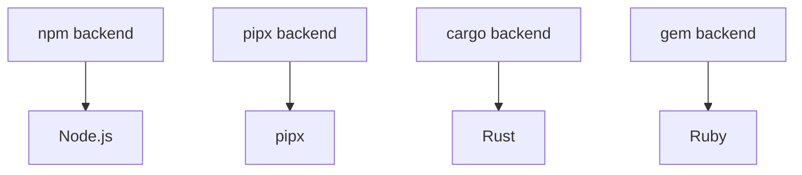

# 后端架构

了解 mise 的后端系统如何工作，可以帮助你为你的工具选择合适的后端，并在问题出现时进行排查。大多数用户并不需要显式选择后端，因为 [mise 注册表](../registry.md) 已定义了智能默认值，但在你需要特定工具或想要优化性能时，理解这个系统会很有帮助。

## 什么是后端？

后端是 mise 支持不同工具安装方式的机制。每个后端都知道如何：

- 列出可用的工具版本
- 下载并安装特定版本
- 为已安装的工具设置环境
- 管理工具生命周期（更新、卸载）

可以把后端看作“适配器”，让 mise 能够与不同的包管理器和安装系统协同工作。

## 后端特性系统

所有后端都实现了一个公共接口（在 Rust 中称为“trait”），这意味着它们都提供相同的基本功能：

```rust
pub trait Backend {
    async fn list_remote_versions(&self) -> Result<Vec<String>>;
    async fn install_version(&self, ctx: &InstallContext, tv: &ToolVersion) -> Result<()>;
    async fn uninstall_version(&self, tv: &ToolVersion) -> Result<()>;
    // ... 其他方法
}
```

这种设计使 mise 能够统一地对待所有后端，而每个后端则处理其安装方式的具体细节。

## 后端类型

### 核心工具

直接内置于 mise 中，使用 Rust 编写，以实现高性能和可靠性：

- **Node.js、Python、Ruby、Go、Java 等** - 原生实现
- **优点**：性能最快、无外部依赖、集成最佳
- **缺点**：需要更多维护；除非是像 Node.js、Python 或 Go 这样非常流行的工具，否则新的核心工具贡献很可能会被拒绝

::: info
像 Node.js 和 Java 这样的核心工具虽然代表的是单个工具，但也是作为后端实现的。这种一致的后端架构使 mise 能够统一处理所有工具，无论它们是复杂生态系统还是单独的工具。
:::

### 语言包管理器

利用现有的语言生态系统：

- **npm** - npm 包（`npm:prettier`、`npm:typescript`）
- **pipx** - Python 包（`pipx:black`、`pipx:poetry`）
- **cargo** - Rust crates（`cargo:ripgrep`、`cargo:fd-find`）
- **gem** - Ruby gems（`gem:bundler`、`gem:rails`）
- **go** - Go modules（`go:github.com/golangci/golangci-lint/cmd/golangci-lint`）

### 通用安装器

#### aqua - 综合包管理器

基于注册表的包管理器，具有强大的安全特性：

- **用法**：`aqua:golangci/golangci-lint`
- **要求**：工具必须在 [aqua 注册表](https://github.com/aquaproj/aqua-registry) 中可用
- **来源**：主要来自 GitHub，但通过注册表配置也支持其他来源
- **安全性**：全面的校验和、签名和验证

#### ubi - 通用二进制安装器（已弃用）

::: warning
ubi 后端已弃用。请改用 [github 后端](/dev-tools/backends/github)。
:::

无需配置的安装器，适用于任何遵循标准约定的 GitHub/GitLab 仓库：

- **用法**：`ubi:BurntSushi/ripgrep` → 迁移为 `github:BurntSushi/ripgrep`
- **要求**：仓库必须遵循标准的发布 tarball 约定
- **来源**：主要是 GitHub releases，并支持 GitLab（在 mise 中很少使用）
- **配置**：无需配置 - 会自动检测并下载合适的二进制文件

### 插件系统

支持外部插件生态系统：

- **工具插件** - 基于钩子的单工具插件（`my-tool`）- 是 vfox 插件功能的超集
- **asdf 插件** - 传统插件生态系统（`asdf:postgres`、`asdf:redis`）- 通常仅支持 Linux/macOS
- **后端插件** - 使用 `plugin:tool` 格式（`my-plugin:some-tool`）的增强型插件 - 通过后端方法支持私有/自定义工具

## 后端选择如何工作

当你指定一个工具时，mise 会按以下优先级确定后端：

1. **显式后端**：`mise use aqua:golangci/golangci-lint`
2. **环境变量覆盖**：`MISE_BACKENDS_<TOOL>`（见下文）
3. **注册表查找**：`mise use golangci-lint` → 检查注册表中的默认后端
4. **核心工具**：`mise use node` → 使用内置的核心后端
5. **回退**：如果未找到，则建议可用的后端

[mise registry](../registry.md) 定义了每个工具应使用哪个后端的优先级顺序，因此通常最终用户不需要知道该选择哪个后端，除非他们想使用注册表中不可用的工具，或者想覆盖默认选择。

### 环境变量覆盖

你可以使用 `MISE_BACKENDS_<TOOL>` 环境变量模式来覆盖任意工具的后端。工具名称会转换为 SHOUTY_SNAKE_CASE（大写，并用下划线替换连字符）。

```bash
# 为 php 使用 vfox 后端
export MISE_BACKENDS_PHP='vfox:mise-plugins/vfox-php'
mise install php@latest
```

### 注册表系统

[mise registry](../registry.md)（`mise registry`）会将短名称映射为完整的后端规格，并按首选优先级顺序排列：

```toml
# ~/.config/mise/config.toml
[tool_alias]
go = "core:go"                    # 使用 core 后端
terraform = "aqua:hashicorp/terraform"  # 使用 aqua 后端
```

## 后端能力比较

| 特性                     | Core | npm/pipx/cargo | aqua | ubi | Backend Plugins | Tool Plugins (vfox) | asdf Plugins (legacy) |
| ------------------------- | ---- | -------------- | ---- | --- | --------------- | ------------------- | --------------------- |
| **速度**                 | ✅   | ⚠️             | ✅   | ✅  | ⚠️              | ⚠️                  | ⚠️                    |
| **安全性**               | ✅   | ⚠️             | ✅   | ⚠️  | ⚠️              | ⚠️                  | ⚠️                    |
| **Windows 支持**         | ✅   | ✅             | ✅   | ✅  | ✅              | ✅                  | ❌                    |
| **环境变量支持**         | ✅   | ❌             | ❌   | ❌  | ✅              | ✅                  | ✅                    |
| **自定义脚本**           | ✅   | ❌             | ❌   | ❌  | ✅              | ✅                  | ✅                    |
| **内置模块**             | ✅   | ❌             | ❌   | ❌  | ✅              | ✅                  | ❌                    |
| **安全证明**             | ❌   | ❌             | ✅   | ❌  | ✅              | ✅                  | ❌                    |
| **多工具插件**           | ❌   | ❌             | ❌   | ❌  | ✅              | ❌                  | ❌                    |
| **进度/日志**            | ✅   | ✅             | ✅   | ✅  | ✅              | ✅                  | ❌                    |

## 何时使用每种后端

### 何时使用 **Core Tools**

- 当你的工具可用时（请查看 [registry](../registry.md)）
- 你希望获得最快的性能
- 你正在使用主流编程语言

在可用时，通常应始终使用 core tools，因为它们能与 mise 提供最佳的性能和集成。

### 何时使用 **Language Package Managers**

- 安装特定于该语言生态系统的工具
- 该工具主要通过该包管理器分发
- 你希望自动依赖管理

### 何时使用 **aqua**

- 安装预编译二进制文件或静态包（无需编译）
- 你希望获得全面的安全特性（校验和、签名）
- 你需要 Windows 支持
- 该工具已在 [aqua registry](https://github.com/aquaproj/aqua-registry) 中提供
- 你愿意为尚未提供的工具向 aqua registry 贡献工具

### 何时使用 **github**

- 从 GitHub releases 安装预编译二进制文件
- 该仓库遵循发布 tarball 的标准约定
- 你希望零配置 - 无需注册表设置
- 你需要简单、快速的二进制安装
- 该工具不需要复杂的构建流程或环境设置

::: info
`ubi` 后端仍然可用，但已被弃用，建议改用 `github`。请将 `ubi:owner/repo` 替换为 `github:owner/repo`。
:::

### 何时使用 **Backend Plugins**

- 你需要用一个插件管理多个工具
- 希望使用增强的后端方法以获得更好的性能
- 需要 `plugin:tool` 格式以获得灵活性
- 使用自定义或私有工具
- 希望采用带有后端方法的现代插件架构

### 何时使用 **Tool Plugins**

- 创建传统的单工具插件
- 需要对安装钩子进行细粒度控制
- 希望使用 vfox 钩子系统
- 工具需要复杂的安装逻辑或构建流程
- 工具需要设置环境变量（如 `JAVA_HOME`、`GOROOT` 等）
- 你需要包括 Windows 在内的跨平台支持

### 何时使用 **asdf Plugins**

- 工具需要从源码编译
- 需要复杂的安装逻辑或构建流程
- 工具需要设置环境变量（如 `JAVA_HOME`、`GOROOT` 等）
- 没有其他后端支持该工具
- 从现有的 asdf 配置迁移
- 在 Linux/macOS 上工作（不支持 Windows）

## 后端依赖

某些后端依赖于其他后端：



mise 会自动处理这些依赖，在安装 npm 工具之前先安装 Node.js，在安装 pipx 工具之前先安装 pipx，等等。

## 配置和覆盖

### 禁用后端

```toml
# ~/.config/mise/config.toml
[settings]
disable_backends = ["asdf", "vfox"] # 不使用这些后端
```

### 为工具强制指定后端

```toml
# mise.toml
[tools]
"core:node" = "20"     # 显式使用 core 后端
"aqua:yarn" = "latest" # 使用 aqua 后端代替默认值（vfox）
```

### 后端特定设置

一些后端支持额外配置：

```toml
# mise.toml
[tools]
python = { version = "3.12", virtualenv = ".venv" }  # core 后端选项
black = { version = "latest", python = "3.12" }      # pipx 后端选项
```

## 后端问题排查

### 调试后端选择

```bash
mise doctor                   # 检查后端配置
mise tool python              # 查看某个工具使用的是哪个后端
mise config get tools         # 验证工具配置
```
