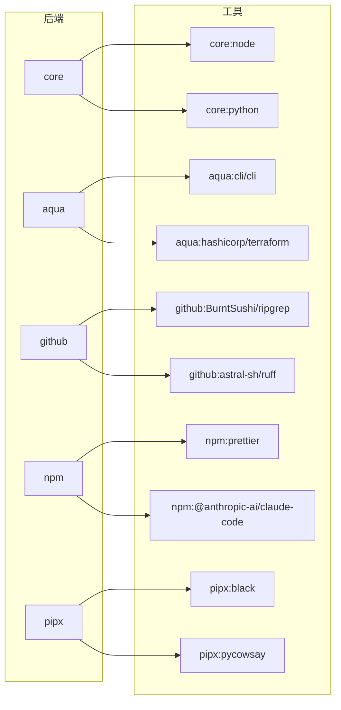

<!-- markdownlint-disable MD034 -->

# 快速开始

在几分钟内上手 mise。

## 1. 安装 `mise` CLI {#installing-mise}

请参阅[安装 mise](/installing-mise.html)了解其他安装 mise 的方式（`macport`、`apt`、`yum`、`nix` 等）。

:::tabs key:installing-mise
== Linux/macOS

```shell
curl https://mise.run | sh
```

默认情况下，mise 会安装到 `~/.local/bin`，但它可以安装到任何位置。

验证安装：

```shell
~/.local/bin/mise --version
# mise 2024.x.x
```

- `~/.local/bin` 不需要在 `PATH` 中。mise 在[激活](#activate-mise)时会自动将其自身目录添加到 `PATH`
  中。

== Windows
::: code-group

```shell [scoop]
scoop install mise
```

```shell [winget]
winget install jdx.mise
```

```shell [chocolatey]
choco install mise
```

== Debian/Ubuntu (apt)

```sh
sudo apt install -y extrepo
sudo extrepo enable mise
sudo apt update
sudo apt install -y mise
```

== Fedora 41+, RHEL/CentOS Stream 9+ (dnf)

```sh
sudo dnf copr enable jdxcode/mise
sudo dnf install mise
```

更多信息请参见 [copr 页面](https://copr.fedorainfracloud.org/coprs/jdxcode/mise/)。

== Snap

```sh
sudo snap install mise --classic
```

更多信息请参见 [snapcraft.io 页面](https://snapcraft.io/mise)。

:::

如果你想更改这些位置，`mise` 会遵循 [`MISE_DATA_DIR`](/configuration) 和 [`XDG_DATA_HOME`](/configuration)。

## 2. mise `exec` 和 `run` {#mise-exec-run}

安装完成后，你就可以立即开始使用 mise 来安装和运行 [工具](/dev-tools/)、启动 [任务](/tasks/)，以及管理 [环境变量](/environments/)。

运行指定版本工具的最快方式是使用 [`mise x|exec`](/cli/exec.html)。例如，要启动一个 Python 3 REPL：

::: tip
如果 `mise` 还不在 `PATH` 中，请改用 `~/.local/bin/mise`。
:::

```sh
mise exec python@3 -- python
# 如果尚未安装，系统会下载并安装 Python
# Python 3.15.0
# >>> ...
```

或者运行 node 26：

```sh
mise exec node@26 -- node -v
# v26.x.x
```

要永久安装某个工具，请使用 [`mise u|use`](/cli/use.html)：

```shell
mise use --global node@26 # 安装 node 26 并将其设为全局默认值
mise exec -- node my-script.js
# 使用 node 26 运行 my-script.js...
```

[`mise r|run`](/cli/run.html) 允许你在加载完整的 mise 上下文（工具 + 环境变量）后运行 [任务](/tasks/) 或脚本。

::: tip
你可以在 shell 的 rc 文件中设置一个 shell 别名，例如 `alias x="mise x --"`，以节省一些按键。
:::

## 3. 激活 `mise` <Badge text="可选" /> {#activate-mise}

`mise exec` 很适合一次性命令，但对于交互式 shell，你大概会希望激活 mise，这样工具和环境变量就会自动加载。

有两种方式：

- [`mise activate`](/cli/activate) — 每次提示符运行时都会更新你的 `PATH` 和环境变量。推荐用于交互式 shell。
- [Shims](dev-tools/shims.md) — 拦截命令并加载正确环境的符号链接。更适合 CI/CD、IDE 和脚本。注意，[shims 不支持 `mise activate` 的所有功能](/dev-tools/shims.html#shims-vs-path)。

你也可以跳过这两种方式，直接调用 `mise exec` 或 `mise run`。
更多信息请参见[本指南](dev-tools/shims.md)。

以下是为你的 shell 激活 mise 的方法：

:::tabs key:installing-mise

== https://mise.run

::: code-group

```sh [bash]
echo 'eval "$(~/.local/bin/mise activate bash)"' >> ~/.bashrc
```

```sh [zsh]
echo 'eval "$(~/.local/bin/mise activate zsh)"' >> ~/.zshrc
```

```sh [fish]
echo '~/.local/bin/mise activate fish | source' >> ~/.config/fish/config.fish
```

== Brew

::: code-group

```sh [bash]
echo 'eval "$(mise activate bash)"' >> ~/.bashrc
```

```sh [zsh]
echo 'eval "$(mise activate zsh)"' >> ~/.zshrc
```

```sh [fish]
# 什么都不用做！使用 brew 和 fish 时，mise 会自动激活
# 你可以通过 `set -Ux MISE_FISH_AUTO_ACTIVATE 0` 来禁用此行为
```

== Windows

将以下内容添加到你的 PowerShell 配置文件（`$PROFILE`）中：

```powershell
(&mise activate pwsh) | Out-String | Invoke-Expression
```

如果你需要打开你的 PowerShell 配置文件：

```powershell
# 如果配置文件不存在则创建
if (-not (Test-Path $profile)) { New-Item $profile -Force }
# 打开配置文件
Invoke-Item $profile
```

- 如果不使用 PowerShell，请将 `<homedir>\AppData\Local\mise\shims` 添加到 `PATH`。

== 其他包管理器

::: code-group

```sh [bash]
echo 'eval "$(mise activate bash)"' >> ~/.bashrc
```

```sh [zsh]
echo 'eval "$(mise activate zsh)"' >> ~/.zshrc
```

```sh [fish]
echo 'mise activate fish | source' >> ~/.config/fish/config.fish
```

:::

修改 rc 文件后，请重启你的 shell 会话。运行 [`mise dr|doctor`](/cli/doctor.html) 来验证一切是否已正确设置。

激活 mise 后，工具可以直接通过 `PATH` 使用：

```sh
mise use --global node@26
node -v
# v26.x.x
```

当你运行 `mise use --global node@26` 时，mise 会更新你的全局配置：

```toml [~/.config/mise/config.toml]
[tools]
node = "26"
```

### Shell 功能兼容性 {#shell-feature-compatibility}

并非所有 shell 都支持 mise 的每一项功能：

| 功能                         | Bash | Zsh | Fish | Nushell | Elvish | Xonsh | PowerShell |
| ------------------------------- | ---- | --- | ---- | ------- | ------ | ----- | ---------- |
| `mise activate`                 | 是   | 是  | 是   | 是      | 是     | 是    | 是         |
| `mise shell`                    | 是   | 是  | 是   | 是      | 是     | 是    | 是         |
| Shell 别名（`[shell_alias]`）   | 是   | 是  | 是   | 否      | 否     | 是    | 否         |
| `chpwd` 钩子                    | 是   | 是  | 是   | 是      | 是     | 是    | 是         |

## 4. 从后端使用工具（npm、pipx、core、aqua、github） {#tool-backends}



后端是 mise 从中拉取工具的包生态系统。通过 `mise use`，你可以从其中任何一个安装工具。

从 npm 安装 [claude-code](https://www.npmjs.com/package/@anthropic-ai/claude-code)：

```sh
# 一次性使用
mise exec npm:@anthropic-ai/claude-code -- claude --version

# 或全局安装
mise use --global npm:@anthropic-ai/claude-code
claude --version
```

通过 pipx 从 PyPI 安装 [black](https://github.com/psf/black)：

```sh
# 一次性使用
mise exec pipx:black -- black --version

# 或全局安装
mise use --global pipx:black
black --version
```

直接从 GitHub 发布版本安装 [ripgrep](https://github.com/BurntSushi/ripgrep)：

```sh
# 一次性使用
mise exec github:BurntSushi/ripgrep -- rg --version

# 或全局安装
mise use --global github:BurntSushi/ripgrep
rg --version
```

上面的每个 `mise use` 命令都会更新你的配置文件。例如，在将这三项都全局运行后，你的 `~/.config/mise/config.toml` 将包含：

```toml [~/.config/mise/config.toml]
[tools]
"npm:@anthropic-ai/claude-code" = "latest"
"pipx:black" = "latest"
"github:BurntSushi/ripgrep" = "latest"
```

你也可以直接编辑 `mise.toml`，而不是使用 `mise use`——效果是一样的。编辑后运行 `mise install` 来安装这些工具。

更多生态系统和细节请参见 [后端](/dev-tools/backends/)。

## 信任配置文件 {#trust}

当你或团队成员将 `mise.toml` 添加到项目中时，mise 可能会提示你信任该文件，然后才会运行其中的环境指令或钩子：

```
mise ~/my-project/mise.toml is not trusted. Trust it? [y/n]
```

这是一个安全措施——配置文件可以通过 `[env]` 指令、钩子和任务执行任意代码。要信任某个文件，请运行：

```sh
mise trust
```

在普通模式下，`mise run`、裸任务调用（例如 `mise <TASK>`）、`mise install`、`mise exec` 和 `mise watch` 会自动信任活动配置，因为这些命令会显式执行项目定义的行为。严格模式要求对所有非全局配置运行 `mise trust`，包括在普通模式下安全的配置。

要禁用某个路径的信任提示，请配置：

```sh
mise settings trusted_config_paths=["/"]
```

或者设置环境变量 `MISE_TRUSTED_CONFIG_PATHS=/`。

::: tip
`mise use` 会自动信任它创建的文件。
:::

请参阅 [`mise trust`](/cli/trust) 了解更多详情。

## 5. 设置环境变量 {#environment-variables}

在 `mise.toml` 中定义环境变量——每当 mise 被激活时，或者使用 `mise exec` 时，它们都会被加载：

```toml [mise.toml]
[env]
NODE_ENV = "production"
```

```sh
mise exec -- node --eval 'console.log(process.env.NODE_ENV)'

# 或者如果 mise 已在你的 shell 中激活
echo "node env: $NODE_ENV"
# node env: production
```

## 6. 运行任务 {#run-a-task}

在 `mise.toml` 中定义任务，并使用 `mise run` 运行它们：

```toml [mise.toml]
[tasks]
hello = "echo hello from mise"
```

```sh
mise run hello
# hello from mise
```

:::tip
mise 会在运行任务之前自动安装 `mise.toml` 中的所有工具。
:::

有关定义和运行任务的更多信息，请参见 [tasks](/tasks/)。

## 7. 下一步 {#next-steps}

请按照 [操作指南](/walkthrough) 查看更多关于如何使用 mise 的示例。

### 设置自动补全 {#autocompletion}

请参阅 [自动补全](/installing-mise.html#autocompletion) 了解如何为你的 shell 设置自动补全。

### GitHub API 速率限制 {#github-api-rate-limiting}

::: warning
mise 中的许多工具都需要 GitHub API。未认证的请求通常会受到速率限制——如果你看到 4xx 错误，请参阅 [GitHub 令牌](/dev-tools/github-tokens.html) 了解如何配置身份验证。
:::
