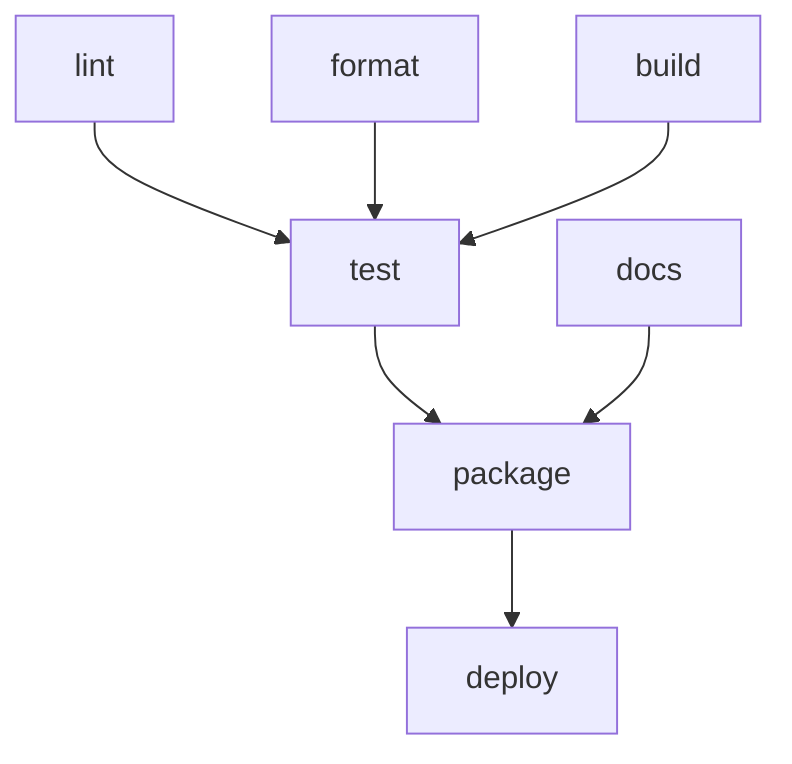

# 任务系统架构

了解 mise 的任务系统如何工作，有助于你编写更高效的任务并排查依赖问题。

## 任务依赖系统

mise 使用一个复杂的依赖图系统来管理任务执行顺序和并行性。这确保了任务按正确顺序运行，同时通过并行执行最大化性能。

### 依赖图解析

当你运行 `mise run build` 时，mise 会创建一个包含所有任务及其依赖关系的有向无环图（DAG）：



该图确保：

- 依赖项先于依赖它们的任务运行
- 独立任务并行运行
- 不存在循环依赖
- 依赖失败会阻止后续任务运行

### 依赖类型

mise 支持三种类型的任务依赖：

#### `depends` - 前置条件

必须在此任务运行前成功完成的任务：

```toml
[tasks.test]
depends = ["lint", "build"]
run = "npm test"
```

#### `depends_post` - 清理任务

在此任务完成后运行的任务（无论成功还是失败）：

```toml
[tasks.deploy]
depends = ["build", "test"]
depends_post = ["cleanup", "notify"]
run = "kubectl apply -f deployment.yaml"
```

清理任务的常规依赖属于同一个后置阶段子树，并且在父任务完成之前不会启动。如果父任务已启动，即使父任务失败，Mise 也会运行该子树；但如果常规依赖在父任务启动前失败，则会跳过整个子树。同时作为常规依赖和后置依赖使用的任务，在每个阶段中都会分别执行一次。

#### `wait_for` - 软依赖

如果这些任务也在当前执行中，则应先运行，但如果它们不可用也不会失败：

```toml
[tasks.integration-test]
wait_for = ["start-services"]  # 仅在 start-services 也正在运行时才等待
run = "npm run test:integration"
```

## 并行执行引擎

### 作业控制

mise 会在配置的作业限制内并行执行任务：

```bash
mise run --jobs 8 test        # 使用 8 个并行作业
mise run -j 1 test            # 强制顺序执行
```

默认值为 4 个并行作业，但你可以全局配置它：

```toml
# ~/.config/mise/config.toml
[settings]
jobs = 8
```

### 示例执行流程

给定以下任务：

```toml
[tasks.lint]
run = "eslint src/"

[tasks.test-unit]
depends = ["lint"]
run = "npm run test:unit"

[tasks.test-integration]
depends = ["lint"]
run = "npm run test:integration"

[tasks.build]
depends = ["test-unit", "test-integration"]
run = "npm run build"
```

使用 `--jobs 2` 执行：

```
时间 →
0s:   [lint]
5s:   [test-unit] [test-integration]  # 在 lint 之后并行运行
15s:  [build]                        # 等待两个测试都完成
```

## 任务发现与解析

### 任务来源

mise 按以下顺序从多个来源发现任务：

1. **文件任务**：任务目录中的可执行文件
2. **TOML 任务**：在 `mise.toml` 文件中定义
3. **父目录任务**：可从父目录获取

### 任务解析过程

当你运行 `mise run build` 时，mise 会：

1. **发现所有任务**，来自所有配置来源
2. **解析任务名称**（处理别名和部分匹配）
3. **构建依赖图**，包括所有依赖项
4. **验证图**（检查循环依赖）
5. **按依赖顺序执行**，并支持并行

### 跨目录的任务解析

父目录中的任务在子目录中可用，并且可以被覆盖：

```
project/
├── mise.toml              # 定义：lint、test、build
└── frontend/
    └── mise.toml          # 覆盖：test，新增：bundle
```

在 `frontend/` 中，你可以访问：`lint`（来自父目录）、`test`（已覆盖）、`build`（来自父目录）、`bundle`（本地）。

## 高级依赖特性

### 条件依赖

使用任务参数实现条件行为：

```toml
[tasks.test]
depends = ["build"]
run = '''
#!/usr/bin/env bash
if [ "$1" = "--with-lint" ]; then
  mise run lint
fi
npm test
'''
```

shebang 可确保脚本在所有平台上都通过 bash 运行。否则，mise 会使用平台默认的内联 shell（Unix 上是 `sh -c`，Windows 上是 `cmd /c`），因此 bash 的 `[ ... ]` 测试在 Windows 主机上会解析失败。对于更丰富的参数处理，建议使用 [`usage` 字段](/tasks/task-arguments#usage-field)，而不是位置参数。

### 动态依赖

任务可以在运行时指定依赖：

```bash
#!/usr/bin/env bash
#MISE depends=["setup"]

# 额外的条件依赖
if [ ! -f ".env" ]; then
  mise run generate-env
fi

npm start
```

### 跨项目依赖

引用其他目录中的任务：

```toml
[tasks.deploy-all]
depends = [
  "../api:build",
  "../frontend:build",
  "deploy-infrastructure"
]
run = "echo '所有服务已部署'"
```

## 性能优化

### 源文件与输出跟踪

如果源文件没有变化，任务可以跳过执行：

```toml
[tasks.build]
sources = ["src/**/*.ts", "package.json"]
outputs = ["dist/**/*"]
run = "npm run build"
```

mise 仅在以下情况下运行该任务：

- 源文件比输出文件更新
- 任务从未运行过
- 依赖项已更改

### 增量执行

使用 `mise run --force` 来忽略源文件/输出检查：

```bash
mise run --force build     # 始终运行，忽略源文件更改
```

### 并行文件监视

使用 `mise watch` 进行持续开发：

```bash
mise watch              # 监视所有任务源文件
mise watch build test   # 监视特定任务
```

当其源文件发生更改时，这会自动重新运行任务。

## 调试任务依赖

### 可视化依赖关系

```bash
mise tasks deps build           # 显示 build 的依赖
mise tasks deps --dot > deps.dot # 生成 graphviz 图表
```

### 执行跟踪

```bash
mise run --verbose build       # 显示任务执行详情
mise run --dry-run build       # 显示在不执行的情况下将会运行什么
```

### 常见问题

**循环依赖**：

```
Error: Circular dependency detected: test → build → test
```

解决方案：移除循环引用，或使用 `wait_for` 代替 `depends`。

**缺少依赖**：

```
Error: Task 'build' depends on 'lint' but 'lint' was not found
```

解决方案：定义缺失的任务，或移除该依赖。

**并行执行缓慢**：

- 检查任务是否存在不必要的依赖
- 使用 `mise tasks deps` 验证依赖图
- 如果有可用 CPU 核心，考虑增加 `--jobs`

该任务架构旨在从简单的单任务项目扩展到具有复杂构建依赖的复杂多服务应用程序。
