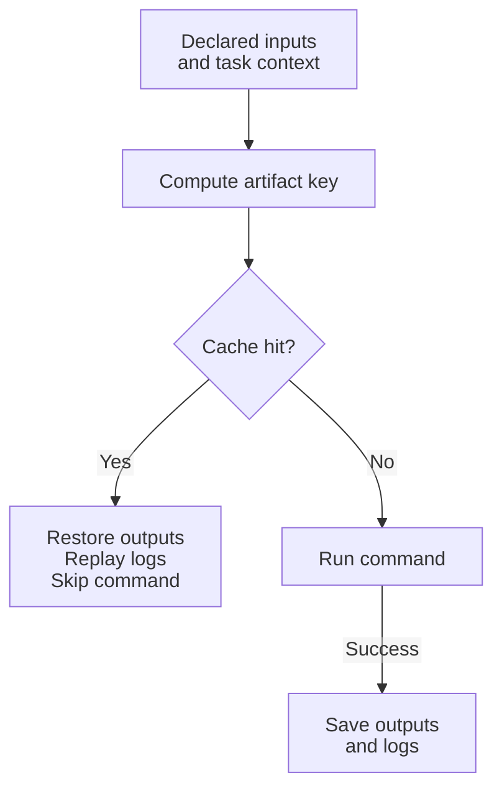

# 任务缓存

使用普通的 `sources` 和 `outputs` 检查来跳过已经是最新状态的工作。当你还需要在切换输入或删除构建输出后复用成功结果时，启用实验性 artifact 缓存。

| 机制 | 比较内容 | 命中时 |
| ---------------- | ---------------------------------------------------- | ---------------------------------------------------- |
| 新鲜度检查 | 源和输出的修改时间 | 保留现有输出并跳过任务 |
| Artifact 缓存 | 声明的输入内容和其他缓存键材料 | 恢复声明的输出并重放捕获的日志 |

有关新鲜度配置，请参阅 [`sources`](/tasks/task-configuration.html#sources) 和 [`outputs`](/tasks/task-configuration.html#outputs)。本指南的其余部分介绍实验性的 artifact 缓存。

## Artifact 缓存流程

对于启用了 artifact 缓存、且允许读取和写入缓存的符合条件的任务，mise 使用以下流程：



这描述的是 artifact 缓存，而不是上面的修改时间新鲜度检查。使用 `outputs = []` 时，命中会复用成功结果和日志，而不会恢复文件。失败的运行不会被缓存。强制运行、禁用缓存访问以及不符合条件的任务可以绕过此流程的部分环节；请参阅[每次运行的缓存访问](#per-run-cache-access)和[存储与输出重放](#storage-retention-and-output-replay)。

## 启用 Artifact 缓存

将成功的任务结果存储在内容寻址的本地缓存中，并在再次看到相同的任务输入时复用这些结果。声明的文件系统输出在删除后会被恢复。使用 `outputs = []` 的任务会缓存其成功结果和日志，而不会存储文件系统 artifact，这对于 lint、测试和类型检查等检查很有用。声明 `outputs = []` 表示该任务没有缓存命中时需要复现的文件系统副作用。

Artifact 缓存要求 [`experimental`](/configuration/settings.html#experimental)、至少一个匹配的 `source`，以及显式输出路径或 `outputs = []`。不支持 `outputs = { auto = true }`、绝对输出路径，以及逃逸出任务目录的输出模式（包括排除项的主体）。

```mise-toml
[settings]
experimental = true

[tasks.build]
run = "npm run build"
sources = ["package.json", "src/**"]
outputs = ["dist"]
cache = { enabled = true, env = ["NODE_ENV"] }
```

`cache.command_inputs` 中列出的命令会在缓存查找之前运行。命令文本、stdout 和 stderr 都会包含在缓存键中。命令使用与任务相同的内联 shell（包括 CLI `--shell` 覆盖项）、解析后的环境和工具、工作目录以及沙箱策略。当编译器版本或生成的配置等输入无法仅通过源文件表示时，这很有用。

```mise-toml
[tasks.build]
run = "npm run build"
sources = ["package.json", "src/**"]
outputs = ["dist"]
cache = { enabled = true, command_inputs = ["node --version", "npm config get registry"] }
```

命令输入必须非空并成功退出。其输出会经过哈希处理，但不会被打印或保留。命令输入继承任务超时；如果任务没有超时，则使用 30 秒超时；其 stdout 和 stderr 总输出最多为 16 MiB。命令输入应当快速、确定，并且没有副作用，因为每当 mise 计算任务缓存键时都会运行它们。在试运行期间，或对原始执行或交互式执行禁用缓存时，不会运行命令输入。

设置 `cache.audit = true` 可在 Linux 上诊断不完整的缓存声明。当任务执行时，mise 使用 `strace` 报告工作区根目录下与 `sources` 不匹配的读取，以及任务目录下与 `outputs` 不匹配的写入。审计仅提供建议，不会阻止任务，也不会阻止成功结果被缓存。根目录之外的访问和目录元数据读取会被忽略，以避免系统库、可执行文件和路径遍历出现在报告中。

报告的路径始终相对于任务目录，并对读取可能合法触及的、位于任务目录上方的路径使用 `..`。报告的读取路径可以按照打印时的原样添加到 `sources` 中。

审计模式要求 `PATH` 中存在 `strace`。如果无法进行跟踪，mise 会发出警告并正常运行任务；其他平台目前不受支持。缓存任务不会执行，因此不会生成审计报告，所以检查现有缓存条目时请使用 `mise run --force <task>`。

每个任务的控制台警告最多显示前 20 个路径，这不足以对读取数千个未声明文件的任务进行分类。设置 [`task.cache.audit_report`](/configuration/settings.html#task.cache.audit_report) 后，还会将每个未声明路径写为 JSON Lines，每个条目是一个 `{"task", "kind", "path"}` 对象。截断每次 `mise` 调用只发生一次：每次调用中第一个经过审计的任务会截断文件，之后该次调用中经过审计的任务会追加到文件，因此一个文件会保存该次运行中所有经过审计的任务的报告；后续运行会替换它，而不是追加到其中。

```shell
MISE_TASK_CACHE_AUDIT_REPORT=audit.jsonl mise run --force build
```

```mise-toml
[tasks.build]
run = "npm run build"
sources = ["package.json", "src/**"]
outputs = ["dist"]
cache = { enabled = true, audit = true }
```

## 外部依赖和锁文件

将依赖清单和锁文件声明为文件系统输入，以便依赖更新使缓存失效。它们可以直接列在任务的 `sources` 中，通过输入组共享，或使用 `task_config.global_inputs` 应用于配置作用域中的每个任务。

```mise-toml
[settings]
experimental = true

[task_config]
global_inputs = ["@group:node-dependencies"]

[task_config.input_groups]
node-dependencies = ["package.json", "pnpm-lock.yaml"]

[tasks.build]
run = "pnpm build"
sources = ["src/**"]
outputs = ["dist"]
cache = { enabled = true }
```

锁文件内容表示已解析的外部依赖关系图，因此通常不应包含 `node_modules` 等已安装的依赖目录。已解析的 mise 工具已经参与缓存键计算。对于提交文件中未捕获、但相关的外部状态，例如软件包注册表选择或编译器包装器版本，请使用 `cache.command_inputs`：

```mise-toml
[tasks.build]
run = "pnpm build"
sources = ["package.json", "pnpm-lock.yaml", "src/**"]
outputs = ["dist"]
cache = { enabled = true, command_inputs = ["pnpm config get registry"] }
```

只声明会影响任务输出的确定性外部状态。机密和凭据应改用直通环境变量，以免其值包含在缓存键中。

## 每次运行的缓存访问

使用 `mise run --task-cache <mode>` 或 `MISE_TASK_CACHE`，控制一次运行中任务输出缓存的读取和写入：

- `read-write` 使用缓存结果并发布新结果。这是默认值
- `read-only` 使用缓存结果，但不会发布未命中结果
- `write-only` 发布结果，但始终执行，而不是恢复结果
- `off` 禁用任务输出缓存，并使用普通的源／输出新鲜度检查
- `local-only` 只读取和写入本地缓存，绕过任何已配置的远程服务

```bash
# 防止不受信任的拉取请求发布缓存条目
mise run --task-cache read-only test

# 在不使用现有条目的情况下预热本地缓存
mise run --task-cache write-only build

# 在不读取或写入任务输出 artifact 的情况下诊断任务
mise run --task-cache off --force build
```

这些模式只影响由任务的 `cache` 属性配置的实验性任务输出缓存。现有的 `--no-cache` 选项控制远程任务定义的获取。

## 远程缓存和敏感数据

使用 `task.cache.remote_url` 和非空的 `task.cache.remote_namespace` 配置实验性的远程构建缓存服务。命名空间是不透明的仓库或组织标识符；服务器必须同时根据命名空间和缓存键隔离条目。它是路由元数据，而不是身份验证机制或机密。在写入者不应彼此影响缓存条目的地方，应使用不同的命名空间。

```mise-toml
[settings]
experimental = true
task.cache.remote_url = "https://cache.example.com/mise/"
task.cache.remote_namespace = "acme/widgets"
task.cache.remote_mode = "read-write"
```

客户端只允许 GitHub Actions 或 GitLab 中已识别的受保护分支推送任务进行远程写入。本地运行、拉取请求、标签和无法识别的 CI 上下文仅限读取；在这些上下文中，只写配置会禁用远程操作。服务器必须独立执行授权。请参阅[远程协议](./remote-cache-protocol.html#transport-and-versioning)。

在进程环境中设置 `MISE_TASK_CACHE_REMOTE_TOKEN`，即可发送 bearer 凭据。等效的 `task.cache.remote_token` 设置仅限全局使用，但更推荐环境变量，这样就不需要将令牌写入磁盘。mise 会从设置跟踪输出中隐藏令牌，并将其 HTTP 标头标记为敏感。在回环地址之外，携带凭据的请求需要 HTTPS。未经身份验证的 HTTP 连接会在发出警告后被允许，但不提供传输机密性或服务器身份验证。服务器仍应使用短期、最小权限的凭据，限制命名空间访问，避免记录授权标头，并根据存储缓存对象的敏感性和保留要求对其进行加密或采取其他保护措施。

要轮换凭据，请将 `MISE_TASK_CACHE_REMOTE_TOKEN_FILE` 设置为一个只包含 bearer 令牌的文件。mise 会在每次请求前重新读取该文件，因此支持 Kubernetes 投影的服务账户令牌，而无需重启长时间运行的进程。等效的 `task.cache.remote_token_file` 设置仅限全局使用。

在 GitHub Actions 中，mise 可以自行获取并刷新短期 OIDC 令牌。授予工作流请求身份令牌的权限，并显式设置其 audience：

```yaml
permissions:
  contents: read
  id-token: write

jobs:
  test:
    runs-on: ubuntu-latest
    env:
      MISE_TASK_CACHE_REMOTE_OIDC_AUDIENCE: https://cache.example.com
    steps:
      - uses: actions/checkout@v5
      - uses: jdx/mise-action@v4
      - run: mise run test
```

缓存服务必须信任 GitHub 的 issuer，接受配置的 audience，并为所选命名空间授权工作流的身份声明。mise 从 GitHub 的作业 OIDC 端点获取令牌，只将其保留在内存中，并在过期前刷新。audience 设置仅限全局使用；当工作流缺少 `id-token: write` 权限时，获取操作会失败并显示明确错误。

凭据优先级为显式令牌、令牌文件，然后是自动 OIDC。这使紧急静态凭据可以覆盖工作负载身份，而无需更改项目配置。其他 CI 提供商可以通过 `MISE_TASK_CACHE_REMOTE_TOKEN` 直接提供其签发的 OIDC 令牌；它们不需要特定于协议的集成。

任务缓存条目并非不包含机密的元数据。它们包含捕获的 stdout 和 stderr，以及每个声明的输出文件。mise 会在存储日志前应用配置的输出脱敏，但这不是通用的机密扫描器：任务可能会打印未知凭据，或将凭据写入输出 artifact。除非这些值可以安全地保留，并且可以安全地与本地和远程缓存的每个读取者共享，否则不要缓存此类任务。清除本地条目不会删除已经上传到远程服务的副本；也请使用远程服务的保留和删除控制。

Artifact 校验和可以检测损坏，HTTPS 可以在传输过程中验证已配置的服务器，但校验和不是原始任务运行器提供的签名。任何获准写入某个命名空间的主体都可以发布其读取者会信任的条目。为不受信任的拉取请求任务提供只读凭据或不提供远程凭据，使用 `--task-cache read-only` 防止发布，并将信任程度较低的写入者隔离到单独的命名空间中。

## 缓存正确性和确定性任务

启用 `cache` 是一项正确性声明：相同的缓存键材料必须产生等效的捕获日志和声明输出。每个可能改变结果的值都必须由源或输入组、已解析的 mise 工具、`cache.env`、`cache.command_inputs` 或可缓存依赖的 artifact 键表示。这包括配置和锁文件、区域设置或功能标志、编译器包装器、生成的输入以及相关的外部服务状态。操作系统和架构会自动包含在内；其他机器状态不会。

启用缓存的任务应当是确定性的，不应依赖未声明的文件、墙上时钟时间、随机性、可变的网络响应或环境变量。若无法可靠地捕获此类输入，请为该任务禁用缓存。直通环境变量有意不包含在键中，因此不得影响缓存的日志或输出。只使用凭据获取内容的任务，应根据该内容的稳定摘要或锁文件生成键，而不是根据凭据本身生成键。

声明的输出必须完整描述命中时需要复现的文件系统状态。那些路径之外的副作用——数据库写入、部署、通知以及工作区其他位置的更改——不会被重放。只有在不需要复现任何文件系统副作用时，`outputs = []` 才是正确的。在 Linux 上，`cache.audit = true` 可以揭示许多未声明的工作区读取和写入，但审计仅提供建议，无法证明确定性，也无法观察每个外部依赖。

当正确性不确定时，在诊断期间使用 `--task-cache off`，添加缺失的键输入，并在信任新条目之前强制执行一次未缓存的运行。当任务语义或未声明的外部状态发生变化、且可能与根据不同信任策略生成的条目发生冲突时，请使用不同的远程命名空间。

```mise-toml
[tasks.lint]
run = "eslint ."
sources = ["package.json", "src/**"]
outputs = []
cache = { enabled = true }
```

要在配置作用域中为每个符合条件的任务默认启用缓存，请设置 `task_config.cache`。只有至少有一个源，并且具有显式输出路径或 `outputs = []` 的任务才会继承此默认设置；其他任务仍不会被缓存。任务本地的 `cache` 值会覆盖作用域默认值。

```mise-toml
[settings]
experimental = true

[task_config.cache]
enabled = true
env = ["NODE_ENV"]
command_inputs = ["node --version"]

[tasks.build]
run = "npm run build"
sources = ["package.json", "src/**"]
outputs = ["dist"]

[tasks.deploy]
run = "./deploy.sh"
cache = { enabled = false }
```

缓存键包括源内容、任务定义和参数、解析后的任务环境、`cache.env` 中指定变量的值（或缺失状态）、命令输入输出、已解析的工具版本、依赖 artifact 键，以及操作系统和架构。除非列在 `cache.env` 中，否则从环境进程继承的变量会被忽略。

## 检查和诊断缓存结果

使用 `mise run --task-cache-explain <task>` 打印产生缓存键的输入的确定性细分，但不会打印聚合键本身。环境变量只会根据名称和是否已设置来标识，而 mise 变量只会根据名称来标识，因此该说明不会发布其内容或每个值的摘要。其他可能源自机密的输入——包括源内容、依赖键、命令输出、任务定义和已解析的工具版本——只会按类别和数量报告。匹配的源路径、声明的输出模式、当前解析的输出根目录以及目标平台会直接列出。

将该选项与 `--dry-run` 结合使用，可以检查键输入，而不会执行、恢复或存储任务。显式请求说明时，缓存命令输入仍会运行，因为其输出哈希是键的一部分。

使用 `mise run --dry-run --task-cache-explain-json <task>` 获取机器可读的诊断信息。该命令会针对每个选定任务向 stdout 写入一个紧凑的 JSON 对象，并使用与人工说明相同的脱敏规则。每个对象都包含不透明的 `cache_key`，因此使用者可以区分同一任务的不同调用，而不会暴露其参数或依赖环境值。当模式选择多个任务时，这种 JSON Lines 格式仍可流式处理。缓存命令输入仍会运行，以便准确报告其存在，但不会包含其输出和哈希。

使用 `mise run --task-cache-stats <task>` 打印运行摘要，其中包括 artifact 缓存命中的数量和百分比、恢复的未压缩输出和日志字节数，以及每个恢复条目创建时记录的执行时间。在添加这些元数据之前写入的条目仍然可读，恢复时其字节数和时间计为零。不执行缓存查找的新鲜度跳过不会计为命中或未命中。

使用 `mise cache task <task>` 检查与已配置任务关联的每个本地输出缓存条目。该表会显示每个键、它是否为当前新鲜度条目、其存储大小和可恢复大小、记录的执行时间、上次访问时间以及输出根目录。添加 `--json` 可将结构化输出作为数组返回，即使只有一个任务匹配。在添加任务身份元数据之前创建的条目，如果是任务的当前条目，则可以检查；较早的历史条目会在被重写后变得可发现。

使用 `mise cache clear --task <task>` 仅删除该任务的本地输出缓存条目和新鲜度指针。工作目录中的声明输出以及属于其他任务的条目不会被删除。没有身份元数据的旧版当前条目会被分离但保留，因为无法验证其所有权；发生这种情况时 mise 会发出警告，而 `mise cache clear` 会将其删除。

## 环境变量和缓存键

`task_config.global_env` 会将环境变量名称添加到配置作用域中每个已启用任务的缓存中，包括具有任务本地 `cache` 值的任务。与 `task_config.cache` 下的默认值不同，这些名称始终会与任务本地的 `cache.env` 组合。

```mise-toml
[task_config]
global_env = ["CI", "NODE_ENV"]
```

对于启用缓存的任务，即使禁止环境继承，`cache.env` 或 `task_config.global_env` 中指定的变量仍然可用。禁用缓存的任务和非缓存任务不会通过缓存配置继承变量。对于任务运行时需要、但不应影响缓存键的变量（例如短期凭据），请使用 `pass_through_env`。作用域级别的 `task_config.global_pass_through_env` 等效设置会应用于每个任务。在 mise 的默认非沙箱环境模式下，环境变量已经会自动传递；当通过 `allow_env`、`deny_env`、`deny_all` 或相应的 CLI 选项启用环境沙箱时，这些选项才会发挥作用。

```mise-toml
[task_config]
global_pass_through_env = ["CI_JOB_TOKEN"]

[tasks.build]
pass_through_env = ["NPM_TOKEN"]
```

直通变量可以改变任务行为，却不会使缓存结果失效。任务不应将它们用于影响生成输出的值。它们的值不会添加到键中，也不会作为缓存元数据持久化，但任务仍可能通过将其写入缓存的输出文件或日志来暴露这些值。

## 存储、保留和输出重放

默认情况下，缓存条目存储在 `MISE_CACHE_DIR/task-artifacts/v2` 下。设置实验性的 [`task.cache_dir`](/configuration/settings.html#task.cache_dir) 或 `MISE_TASK_CACHE_DIR`，可以选择其他父目录；mise 会将 artifact 格式保留在其 `v2` 子目录中。默认位置和自定义位置都会包含在 `mise cache clear` 以及手动和自动缓存清理中。只有成功的任务运行会被缓存。缓存读取／写入失败会被视为未命中，并且不会将成功的任务运行转变为失败。

新的缓存条目包含独立于缓存查找键的 BLAKE3 artifact 校验和。它涵盖归档的输出和捕获的任务结果元数据，mise 会在提取文件或重放输出之前验证它。校验和引入之前写入的条目仍然可读。`mise cache task <task> --json` 会包含校验和，供缓存检查工具使用。

读取者、写入者、检查操作以及任务范围的删除操作，会通过每个缓存键的跨进程锁进行协调。因此，并发进程会看到完整的归档和清单对，而不会将正在进行的替换误判为损坏；不相关键的写入者仍然彼此独立。写入失败时，临时归档和清单文件通常会被删除。在后续使用缓存时，mise 还会在获取关联缓存键锁后删除被中断进程遗留的部分文件，因此绝不会删除活动写入者仍在发布的文件。

设置 [`task.cache_max_size`](/configuration/settings.html#task.cache_max_size) 可以限制 artifact 缓存的总大小，或设置 [`task.cache_max_age`](/configuration/settings.html#task.cache_max_age) 根据最后访问时间使条目过期。两个限制都是可选的，并且会在缓存成功写入后应用。当超过大小限制时，mise 会优先删除最近访问时间最早的条目。

当启用缓存的任务执行而不是恢复结果时，mise 会报告原因：没有匹配的条目、条目损坏、强制执行、读取被禁用，或某个依赖完成时没有稳定的缓存键。原始和试运行缓存绕过会保留现有的警告或预览行为，不会被报告为缓存未命中。

Stdout 和 stderr 会作为有序且经过脱敏的流进行存储，并使用缓存命中时选择的输出模式重放。因此，前缀、交错、保持顺序、计时、替换、安静、静默以及按流静默都会像应用于实时输出一样应用于重放输出。原始任务和交互式任务保留继承的终端 I/O，并以保守方式绕过 artifact 缓存。

可缓存依赖会将其 artifact 键贡献给依赖任务的键，因此依赖任务执行、跳过或恢复后，依赖者可以恢复匹配的 artifact。如果某个依赖在没有稳定 artifact 键的情况下执行，其依赖者会采取保守策略并执行。
